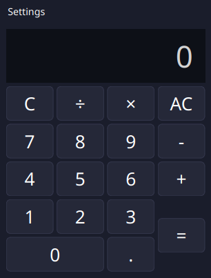
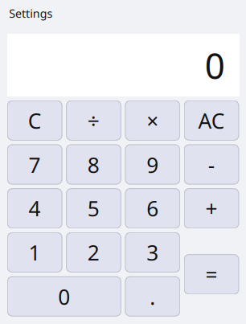

# QtCalc

A simple calculator built with C++ and Qt6.

## Screenshots

| Dark theme | Light theme |
|:---:|:---:|
|  |  |

## Requirements

- Qt6 (Widgets)
- CMake 3.16+
- A C++17 compiler

## Building

```bash
cmake -B build -DCMAKE_BUILD_TYPE=Release
cmake --build build -j$(nproc)
```

The binary is placed at `build/calculator`.

## Usage

```bash
./build/calculator [options]
```

### Options

| Option | Values | Description |
|---|---|---|
| `--theme <theme>` | `dark`, `light` | Override the theme for this session. Does not alter the saved preference. |
| `--help` | | Display usage information and exit. |

**Example:**
```bash
./build/calculator --theme light
```

## Settings

Open **Settings → Preferences** from the menu bar to configure:

- **Theme** — Dark or Light
- **Display font** — Font family and size for the number display
- **Button font** — Font family and size for the calculator buttons

Preferences are saved automatically and persist between sessions (`~/.config/MyCalculator/Calculator.conf`). A `--theme` argument overrides the saved theme for that session only.
